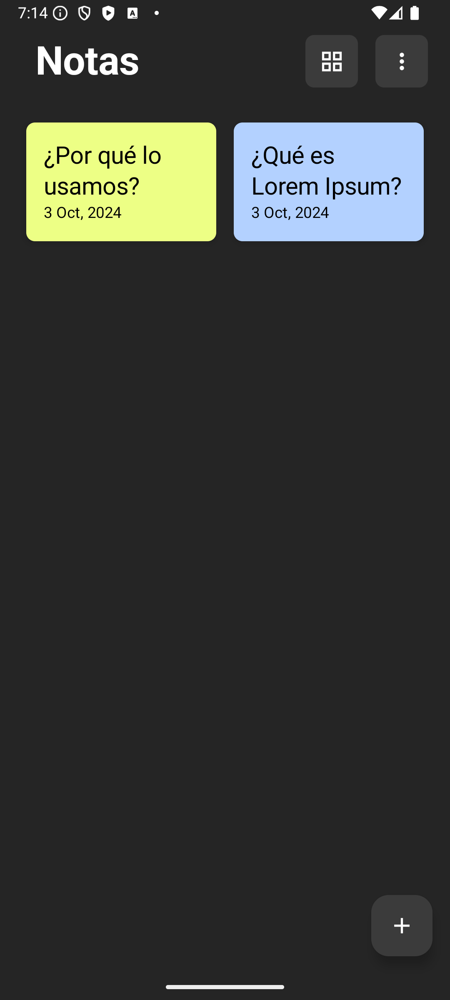
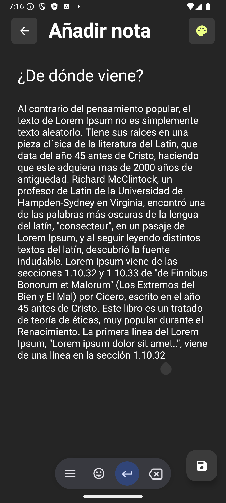
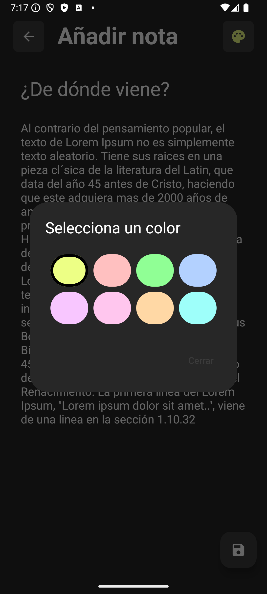
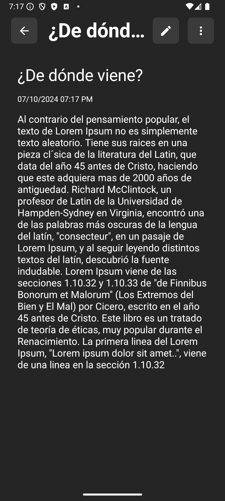
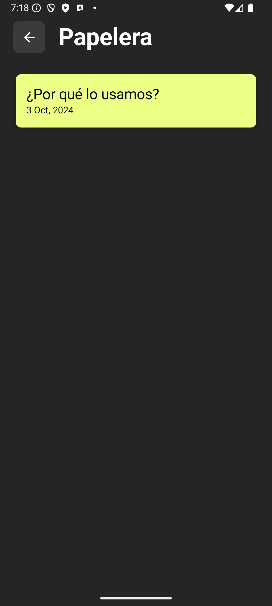
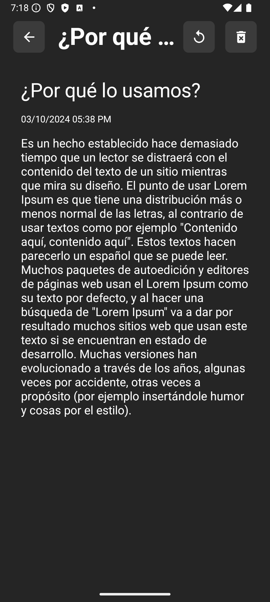

# Aplicación básica de Notas

Esta aplicación móvil fue desarrollada como parte de un proyecto universitario para la materia "Programación Móvil". Su objetivo es brindar al usuario la capacidad de gestionar notas de manera intuitiva, permitiendo agregar nuevas notas, editarlas, eliminarlas de forma temporal o permanente, y restaurar notas previamente eliminadas.

# Tecnologías usadas
* **Kotlin**: Lenguaje de programación.
* **Jetpack Compose**: Para la interfaz de usuario declarativa.
* **MVVM**: Patrón de diseño para separar la lógica de la interfaz de usuario.
* **ViewModel**: Para manejar los datos y el estado de la UI.
* **Room**: Para la persistencia de datos, facilitando el acceso y manipulación de bases de datos locales.
* **Dagger y hilt**: Para la inyección de dependencias que simplifican la gestión de dependencias en la aplicación
 
# Capturas de pantalla
<table>
  <tr>
    <td></td>
    <td></td>
  </tr>
  <tr>
    <td></td>
    <td></td>
  </tr>
  <tr>
    <td></td>
    <td></td>
  </tr>
</table>

# Licencia
Este proyecto está licenciado bajo la Licencia MIT.

# Contacto
Creado por whgarcia.dev@gmail.com
